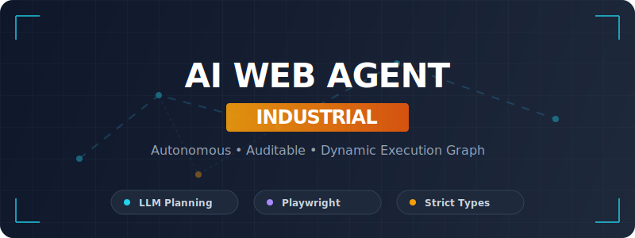

<div align="center">
  
</div>

<div align="center">

## ai-web-agent-industrial：面向实际业务的 Web 自动化 Agent

</div>

### 🌟 项目定位

`ai-web-agent-industrial` 是一个用于 **自动化网页操作与信息整理** 的 Web Agent 框架。  
它希望解决的典型问题是：把日常「打开网站 → 搜索 → 点击 → 提取数据 → 记录到文件」这类枯燥重复操作，交给一个可配置、可回放、便于集成的 Agent 去做。

当前版本主要提供一个基于 `rich` 的命令行前端：你用自然语言描述任务，Agent 通过 **LLM + 动态执行图 (Dynamic Execution Graph)** 来驱动浏览器和本地工具完成任务。

---

### ✨ 主要能力一览

- **自然语言驱动的网页操作**：打开页面、搜索、点击、滚动、输入文本、提取结构化信息等  
- **结构化决策与可回放执行流程**：通过 Pydantic 数据模型组织任务目标、观测、动作与执行节点  
- **浏览器与本地工具联动**：既能控制浏览器，也能调用本地应用或文件操作工具  
- **可视化执行轨迹**：自动输出执行图 HTML，方便排查问题和复盘任务过程  
- **统一的临时文件管理**：所有截图、笔记等输出统一归档到 `temp/` 目录下，便于清理和追踪

更细节的设计、模块说明与扩展方式已移入文档目录，方便独立查看。

---

### 🎬 实机演示

#### 文件操作


#### 浏览器操作


---

### 🚀 快速开始

#### 1. 准备环境

- 建议在 **Windows 10+** 上使用（当前脚本和本地工具主要针对 Windows 做了适配）  
- 推荐 **Python 3.10+**，也可以使用项目提供的内置 Python 环境

如需详细的 Python/Playwright 安装步骤，可以参考文档：`docs/PYTHON_ENV_SETUP.md`。

#### 2. 配置基础参数

在项目根目录创建 `.env` 文件，配置你的 LLM Key 等信息（以 DeepSeek 为例）：

```dotenv
LLM_API_KEY="YOUR_LLM_API_KEY"
LLM_MODEL_NAME="deepseek-chat"
LLM_API_URL="https://api.deepseek.com/v1/chat/completions"

# 浏览器运行模式（True=无头，False=可见窗口）
BROWSER_HEADLESS=False
```

#### 3. 启动命令行 Agent

在项目根目录执行（或双击脚本）：

```cmd
run_agent.cmd
```

选择菜单中的 **1. Run CLI**，进入对话式命令行界面。  
你可以尝试输入一些任务，例如：

- 「搜索某个关键词，整理前几条结果标题到一个文本文件里」  
- 「打开某个官网并截图保存到截图目录」  
- 「在当前页面寻找包含某个关键词的链接，把链接都记录到记事本」  

执行完成后，可以在：

- `temp/notes/` 中查看生成的文本/记录文件  
- `temp/screenshots/` 中查看截图  
- `logs/graphs/` 中打开 HTML 查看整条执行路径

---

### 📘 文档与深入了解

- **开发与架构说明**：`docs/DEV_GUIDE.md`  
- **内置 Python 环境配置**：`docs/PYTHON_ENV_SETUP.md`  
- **项目结构、执行流程与调试细节（开发者视角）**：`docs/devloper/README.md`

如果你计划在此基础上做二次开发、嵌入到自己的系统或增加新的工具，推荐从上述文档开始。

---

### 🔭 适用场景与展望

这个项目更偏向一个 **可二次开发的基础框架**，而不是开箱即用的成品应用。未来可以探索的方向包括：

- 集成到企业内部流程，用于自动化处理固定模板的网页任务  
- 与知识库、RPA 或工单系统打通，形成完整的「输入需求 → 自动执行 → 结果回写」链路  
- 拓展更多浏览器工具与本地工具，支持更多垂直场景（数据标注、简单运维操作、报表下载等）  
- 接入不同的大模型服务，比较在复杂任务拆解和长期执行上的差异

如果你有更具体的业务场景或想法，也可以把这个仓库当作一个起点进行裁剪和改造。

---

### made by like

